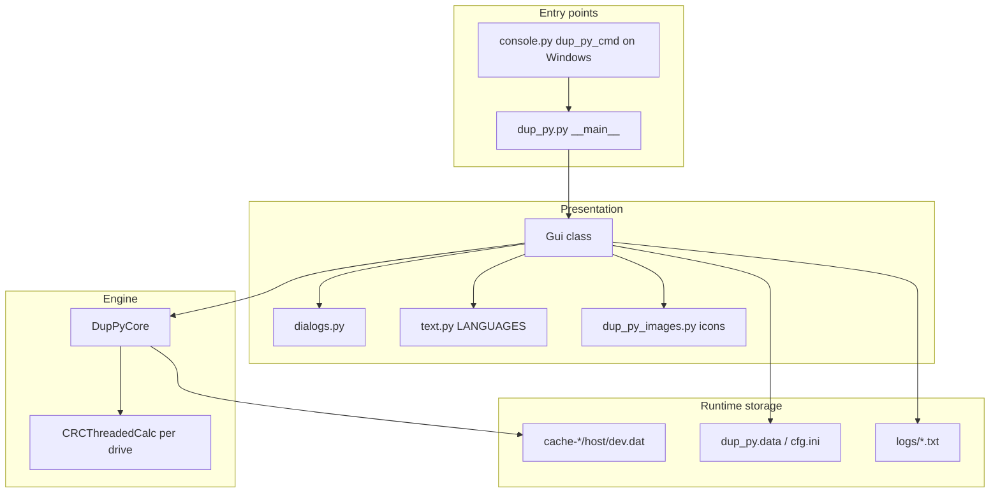
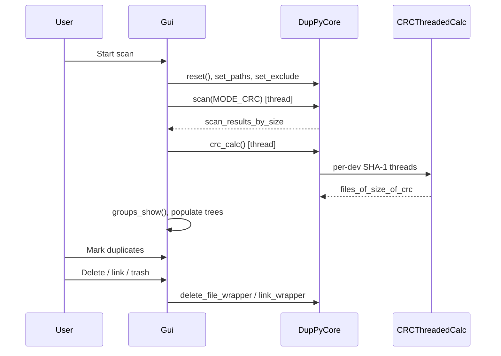

# Architecture

How Dup_py is structured, how data flows through a scan, and where responsibilities live.

## High-level picture

Dup_py is a **Python 3 + Tkinter** desktop app. Almost all product logic sits in two large modules:

| Layer | Module | Role |
|-------|--------|------|
| **Engine** | `src/core.py` | Walk filesystems, hash files, cluster images, cache CRCs, delete/link files |
| **Shell** | `src/dup_py.py` | GUI, config, marking, **Remove duplicates** toolbar, preview, threads into engine |
| **Logging** | `src/dup_py_log.py` | loguru file + console sinks; bridges stdlib `logging` for `DupPyCore` |

Supporting modules: CLI (`console.py`), dialogs, i18n (`text.py`), icons, packaging hooks.

## Execution modes

### 1. GUI (default)

`python src/dup_py.py` → `Gui(...)` → user runs scan from dialog → background threads call `dup_py_core.scan()` then `dup_py_core.crc_calc()` (or image pipelines).

### 2. Headless CSV

`dup_py.py --csv report.csv [paths]` (no window):

1. `DupPyCore.set_paths_to_scan` / `set_exclude_masks`
2. Thread: `scan()` — build size groups
3. Thread: `crc_calc()` — SHA-1 duplicates
4. `write_csv()`

### 3. Windows console wrapper

`console.py` as `dup_py_cmd.exe` parses argv and spawns `dup_py.exe` with the same flags (keeps console open for `--help`).

## Scan pipeline (duplicate-by-hash mode)

This is the default **CRC mode** (`MODE_CRC = 0`).

| Phase | Where | What happens |
|-------|--------|----------------|
| **1. Configure** | `Gui.scan()` ~4187 | Read paths, excludes, size filters; `dup_py_core.reset()` |
| **2. Filesystem walk** | `DupPyCore.scan()` ~346 | `os.scandir` over up to 8 roots; skip symlinks to dirs, hidden, excludes, hardlinks (`st_nlink>1`); optional min/max file size |
| **3. Size grouping** | `scan()` | Each file → `scan_results_by_size[size]` as `(pathnr, path, file_name, mtime, ctime, dev, inode)` |
| **4. Hash** | `crc_calc()` ~1118 | One `CRCThreadedCalc` thread pool entry **per device** (`dev`); SHA-1 content hash; cache hit on `(inode, mtime)` |
| **5. Duplicate groups** | `crc_calc()` | `files_of_size_of_crc[size][crc]` → sets of file tuples sharing hash |
| **6. Display** | `Gui.groups_show()` ~5102 | Upper **groups** tree: CRC/size groups; lower **folder** tree: files in selected group |
| **7. Mark & act** | `Gui` marking ~5529+ | User marks copies; `process_files_core()` calls `DupPyCore.delete_file_wrapper` / `link_wrapper` |

## Scan pipeline (image modes)

Controlled by `operation_mode` in `core.py`:

| Mode | Constant | Flow after walk |
|------|----------|-----------------|
| **Similarity** | `MODE_SIMILARITY = 1` | `images_processing()` → perceptual hashes (average/pHash/dHash) → `similarity_clustering()` (DBSCAN) → `files_of_images_groups` |
| **GPS proximity** | `MODE_GPS = 2` | EXIF GPS → `gps_clustering()` |

Image scan only indexes files with extensions in `IMAGES_EXTENSIONS` (~line 68 in `core.py`).

## Core data structures (`DupPyCore.reset`)

Defined in `src/core.py` ~219–228 and filled during scan/hash:

| Structure | Type (conceptually) | Meaning |
|-----------|---------------------|---------|
| `scan_results_by_size` | `size → set(file tuples)` | All candidate files grouped by byte size (pre-hash) |
| `files_of_size_of_crc` | `size → crc → set(file tuples)` | True duplicate groups (same size + same SHA-1) |
| `files_of_images_groups` | `group_id → set(file tuples)` | Similar-image or GPS clusters |
| `crc_cache` | `dev → {(inode,mtime): sha1_hex}` | Persistent CRC cache (zstd pickle per device) |
| `images_data_cache` | nested dict | Cached image hashes (`imagescache.dat`) |
| `paths_to_scan` | list (max 8) | Absolute scan roots |
| `scanned_paths` | list | Copy used during hash phase |

**File tuple** (CRC mode): `(pathnr, path, file_name, ctime, dev, inode)` — `path` is relative to scan root `pathnr`.

## Threading model

| Component | Threads |
|-----------|---------|
| `CRCThreadedCalc` | One daemon thread per **drive/device**; at most `cpu_count()` active starters in `crc_calc()` loop |
| `images_processing` | `cpu_count()` worker threads hashing images |
| `Gui.scan()` | Spawns daemon threads for `scan` / `crc_calc` / image steps; UI polls progress via `sleep` + widget updates |
| `Image_Cache` | Read-ahead pool per CPU thread for preview thumbnails |

## File actions (engine)

Constants in `core.py`: `DELETE`, `SOFTLINK`, `HARDLINK`, `WIN_LNK`.

| Action | Core method | Notes |
|--------|-------------|-------|
| Trash / delete | `delete_file` / `delete_file_to_trash` | GUI uses `send2trash` when configured |
| Soft link | `do_soft_link` | Optional relative targets |
| Hard link | `do_hard_link` | Same volume |
| Windows shortcut | `do_win_lnk_link` | `.lnk` via pywin32 |

Before processing, GUI checks file state (`check_group_files_state`) so changed `ctime` aborts unsafe operations.

## Configuration & portability

On startup (`dup_py.py` `__main__` ~7261):

- Prefer **`dup_py.data`** next to executable (portable).
- Fallback: `appdirs` for cache/logs/config (`--appdirs` forces this).
- Cache path includes **hostname** so device IDs are not mixed on removable installs.

`Config` class (`dup_py.py` ~219) reads/writes `cfg.ini` (theme, excludes, trash behavior, tooltips, etc.).

## Build / assets (repo root)

| Path | Purpose |
|------|---------|
| `scripts/icons.convert.*` | PNG → embedded `dup_py_images.py` |
| `scripts/version.gen.*` | Version stamps for PyInstaller |
| `scripts/pyinstaller.run.*` / `nuitka.run.*` | Release binaries |
| `src/png.2.py.py` | Icon conversion helper |
| `src/hook-tkinterdnd2.py` | PyInstaller hook for drag-and-drop |
| `requirements.txt` | Runtime deps (numpy, scipy, sklearn, pillow, …) |

## Logging

On startup (`dup_py.py` `__main__`):

1. `setup_logging(log_path, debug=--debug, launcher=DUP_PY_LAUNCHER)` in `dup_py_log.py`
2. loguru writes to stderr and a rotating file under `dup_py.data/logs/`
3. `logging.info` / `DupPyCore` log calls go through `_InterceptHandler` → loguru

Scan milestones logged in `core.py`: `scan walk done`, `crc_calc done`, cache load failures.

## GUI: Remove duplicates toolbar

After `groups_show()` populates results, the user marks files in the folder tree, then:

- **Remove duplicates** (`TkButton` on `groups_toolbar`) → `remove_duplicates_button_wrapper` → `process_files_in_groups_wrapper(DELETE, 1)`

Button state refreshed from `calc_mark_stats_groups`, `post_close`, and end of scan.

## Known engine constraint

See [known-limitations.md](known-limitations.md): large-file I/O, one-scan scope, cache RAM, toolbar button behavior.
